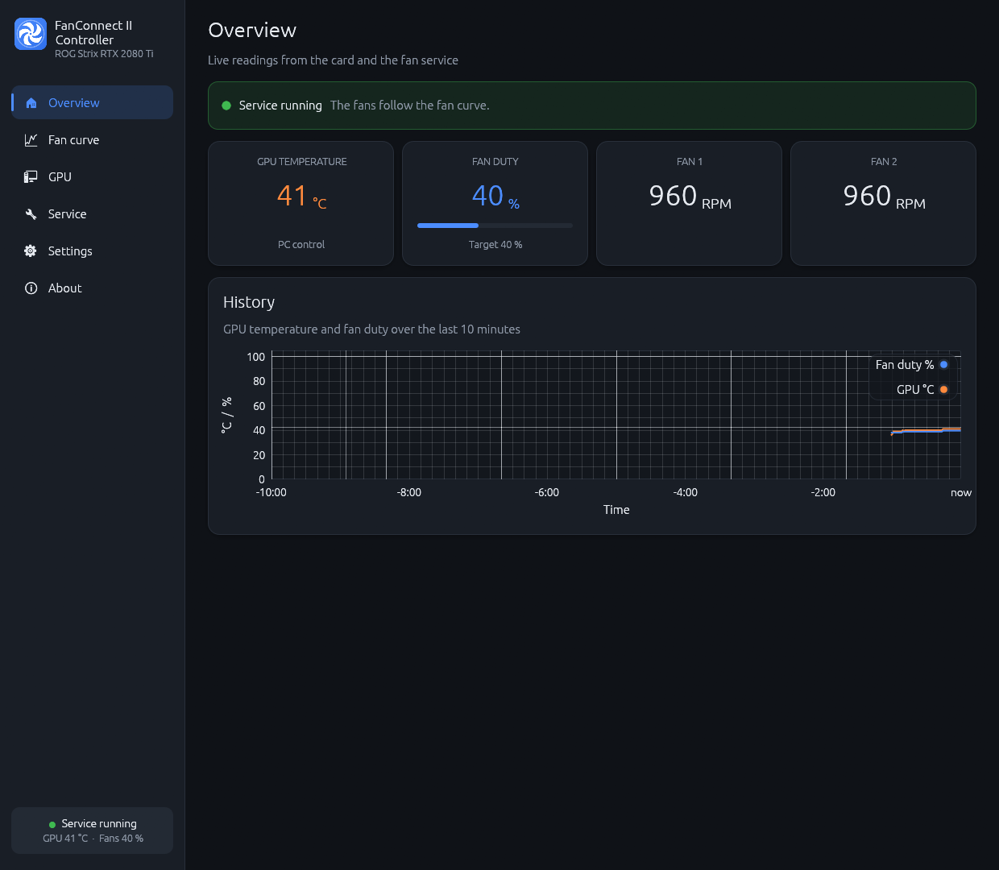
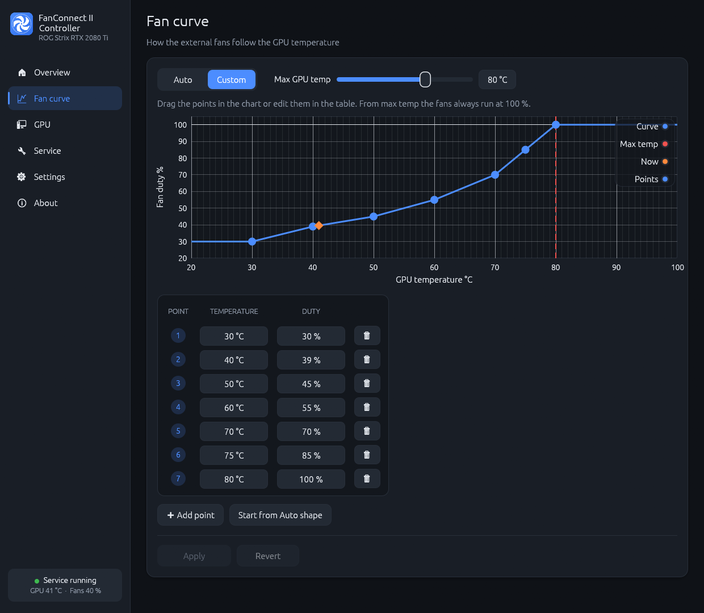
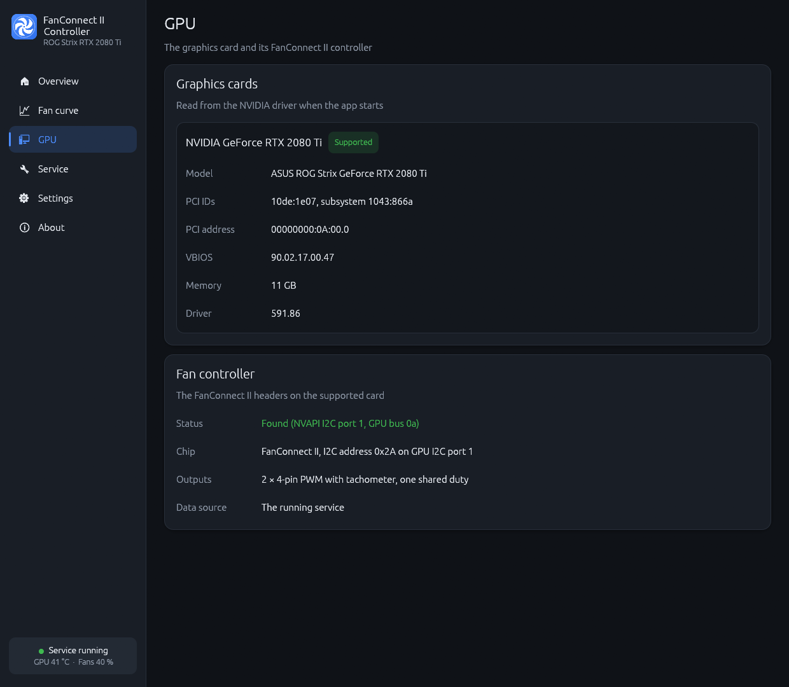
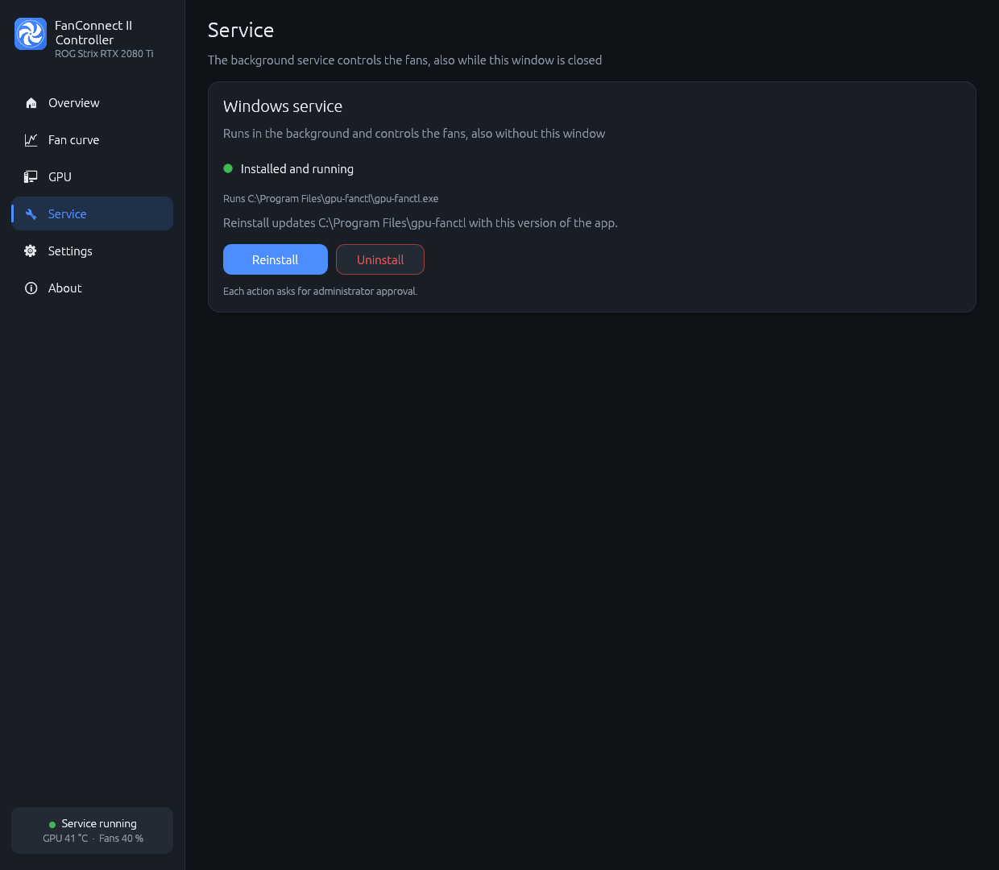
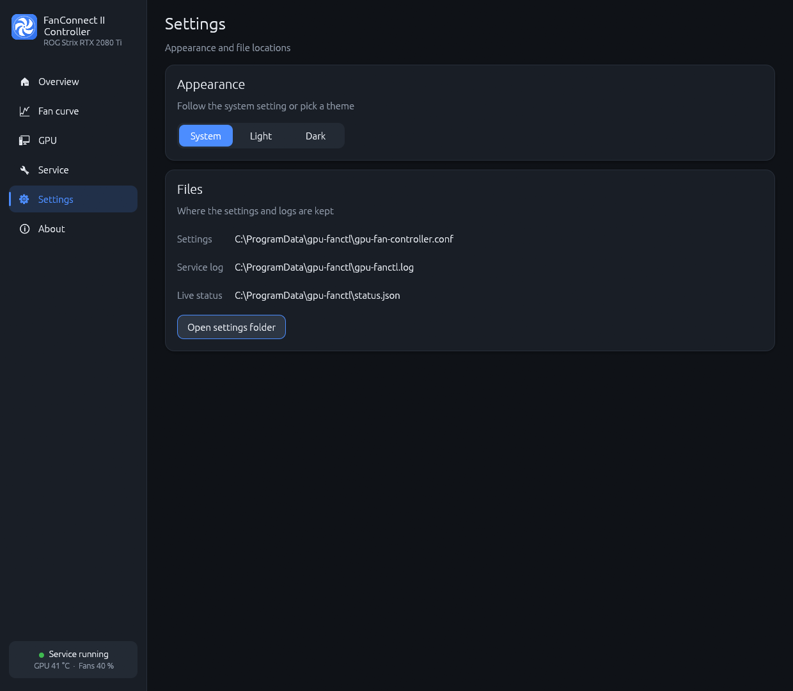
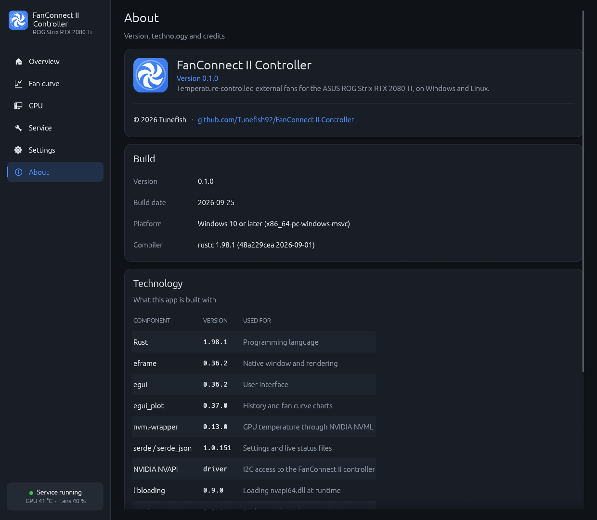
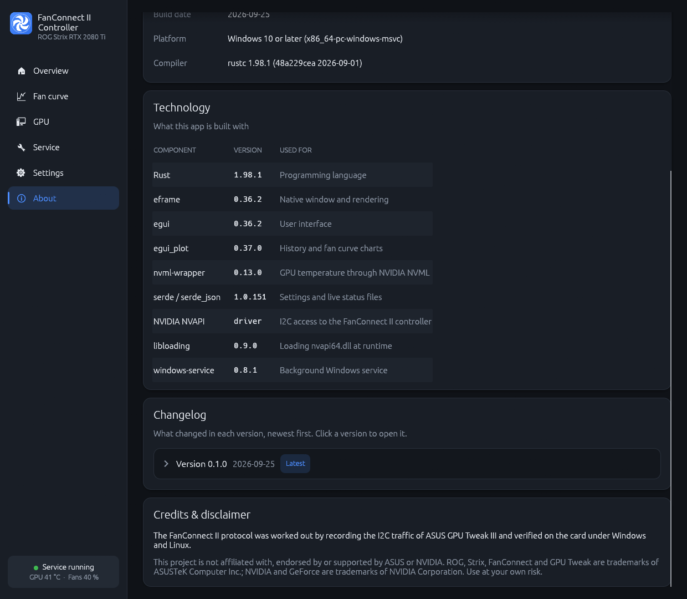
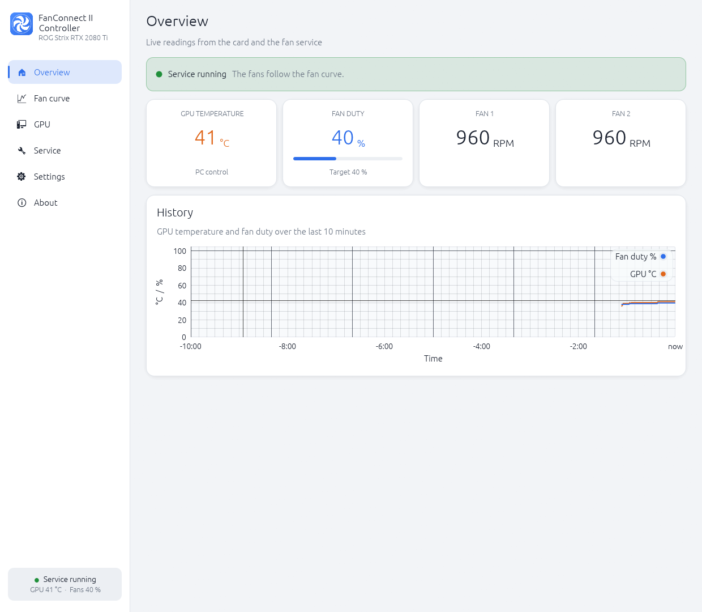
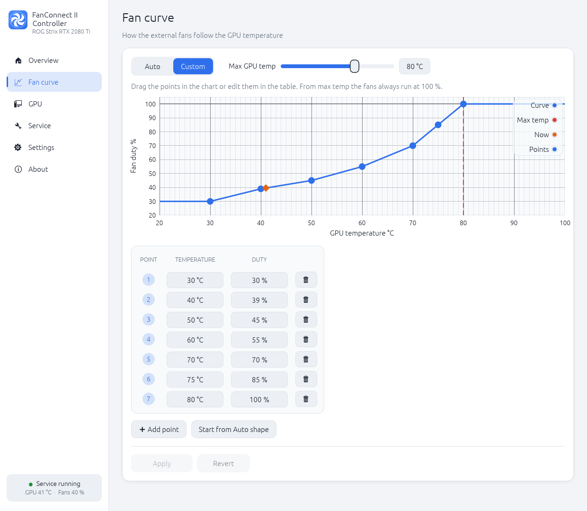

# FanConnect II Controller

Temperature-controlled case fans on the **FanConnect II** headers of the **ASUS ROG Strix GeForce
RTX 2080 Ti**, on **Windows 10+** and **Linux**, without ASUS GPU Tweak III.

Plug up to two case fans into the graphics card's FanConnect II headers, and this app makes them
follow the GPU temperature: with a built-in curve, or one you draw yourself. A small background
service does the controlling. The desktop app shows live data and edits the settings.



> [!NOTE]
> This is an independent project. It is not affiliated with, endorsed by or supported by ASUS or
> NVIDIA. It only controls the two FanConnect II headers, not the GPU's own fans and not the
> motherboard's fan headers. Use at your own risk.

## Contents

- [Features](#features)
- [Screenshots](#screenshots)
- [Supported hardware](#supported-hardware)
- [Installation](#installation)
- [Using the app](#using-the-app)
- [Fan curve and settings](#fan-curve-and-settings)
- [Command line](#command-line)
- [How it works](#how-it-works)
- [Troubleshooting](#troubleshooting)
- [Adding support for another card](#adding-support-for-another-card)
- [Development](#development)

## Features

- **Fans follow the GPU temperature**, with a built-in Auto curve or your own custom curve
  (2–16 points, drag them in a chart or type them into a table).
- **Smooth and quiet:** rises immediately, ignores dips of up to 3 °C, and ramps down slowly
  (2 % per second), so loading screens don't make the fans pump.
- **Safety first:** at or above the max GPU temp (default 80 °C) the fans always run at 100 %.
  If the temperature can't be read, or the service stops, the fans go to 100 %.
- **Background service** (Windows service or systemd service) that keeps working when the app is
  closed and restarts automatically.
- **One-click install** from the app. It asks for administrator approval, copies the programs to a
  fixed location, starts the service and adds Start menu / app menu and desktop shortcuts.
- **Live data:** GPU temperature, fan duty and target, both fans' RPM, and a 10-minute history.
- **Hardware detection:** every NVIDIA card is read at startup (name, PCI IDs, VBIOS, memory,
  driver) and marked as supported or not.
- **Warnings** when GPU Tweak III is also controlling the fans, or a fan reports 0 RPM.
- **Light, dark and system themes.**
- **Command-line tool** `gpu-fanctl` for everything, including scripting.

## Screenshots

| | |
|---|---|
|  **Overview:** service status, live values and history |  **Fan curve:** Auto or custom curve, max GPU temp |
|  **GPU:** detected cards and the fan controller |  **Service:** install, reinstall or uninstall |
|  **Settings:** theme and file locations |  **About:** version and technology |
|  **About:** changelog and credits |  **Light theme:** Overview |
|  **Light theme:** Fan curve | |

## Supported hardware

| Graphics card | PCI IDs | Status |
|---|---|---|
| ASUS ROG Strix GeForce RTX 2080 Ti | `10de:1e07`, subsystem `1043:866a` | ✅ verified on Windows and Linux |

Only verified cards are enabled. The fan controller shares an I2C bus with other chips on the
card (such as the RGB controller), so a write to a guessed address could reach the wrong chip.
Other ASUS ROG Strix and ROG Astral cards also have FanConnect headers (GTX 10 to RTX 50,
Radeon RX 5000/6000). They may work the same way, but each needs to be verified first. See
[Adding support for another card](#adding-support-for-another-card).

**Requirements:** an NVIDIA driver. Windows 10 or later, or a Linux system with the NVIDIA driver
(proprietary or open kernel module) and `i2c-dev`.

## Installation

There are no prebuilt downloads yet. Build from source with [Rust](https://rustup.rs) (stable).

### Windows

```powershell
git clone https://github.com/Tunefish92/FanConnect-II-Controller.git
cd FanConnect-II-Controller
cargo build --release
.\target\release\gpu-fanctl-gui.exe
```

In the app, open **Service** and click **Install service**. After you approve the administrator
prompt, the app:

- copies `gpu-fanctl.exe` and `gpu-fanctl-gui.exe` to `C:\Program Files\gpu-fanctl`,
- installs and starts the Windows service "FanConnect II Controller",
- adds **FanConnect II Controller** shortcuts to the Start menu and the desktop,
- lets users edit the settings, so changes in the app need no admin rights afterwards.

Building needs the Visual Studio C++ build tools ("Desktop development with C++").

### Linux

Tested on CachyOS (Arch-based). Other distributions need the same packages under their names.

```bash
sudo pacman -S --needed rust i2c-tools
git clone https://github.com/Tunefish92/FanConnect-II-Controller.git
cd FanConnect-II-Controller
cargo build --release
./target/release/gpu-fanctl-gui
```

In the app, open **Service** and click **Install service**. After you enter your password
(pkexec/polkit), the app:

- copies `gpu-fanctl` and `gpu-fanctl-gui` to `/usr/local/bin`,
- creates, enables and starts the systemd service `gpu-fanctl`,
- loads `i2c-dev` at every boot,
- adds a **FanConnect II Controller** app menu entry and a desktop shortcut,
- lets users edit the settings file.

To build only the command-line tool, without the app: `cargo build --release --no-default-features`.

### Updating and removing

- **Update:** build the new version, start its app and click **Reinstall**. The installed copy is
  replaced.
- **Remove:** click **Uninstall**. The service stops (the fans go to 100 % and stay there until
  something else controls them), and the service and shortcuts are removed. The programs and your
  settings stay.

The same from a terminal: `gpu-fanctl install`, `gpu-fanctl reinstall`, `gpu-fanctl uninstall`
(as administrator / with `sudo`).

## Using the app

| Page | What you find there |
|---|---|
| **Overview** | Service status, GPU temperature, fan duty and target, both fans' RPM, 10-minute history |
| **Fan curve** | Auto or Custom, max GPU temp, the curve chart with draggable points, the points table, Apply / Revert |
| **GPU** | All NVIDIA cards with name, PCI IDs, VBIOS, memory and driver; where the fan controller was found |
| **Service** | Install, Reinstall and Uninstall the background service |
| **Settings** | Theme (System / Light / Dark) and the locations of the settings and log files |
| **About** | Version, build and technology information, changelog, credits |

The sidebar always shows whether the service is running, plus the current GPU temperature and
fan duty. Without a running service, the app reads the card directly and says so clearly: it
never controls the fans itself.

## Fan curve and settings

**Auto curve** (default): 30 % up to 45 °C, rising to 100 % at the max GPU temp.

| GPU temp (max temp 80 °C) | ≤ 45 °C | 54 °C | 59 °C | 64 °C | 70 °C | 75 °C | ≥ 80 °C |
|---|---|---|---|---|---|---|---|
| Fan duty | 30 % | 35 % | 45 % | 55 % | 70 % | 85 % | 100 % |

**Custom curve:** 2–16 points of temperature (20–100 °C, rising) and duty (30–100 %, never
falling). When you switch back to Auto, your custom curve is remembered.

**Max GPU temp** (60–90 °C, default 80 °C): from this temperature the fans always run at 100 %,
whichever curve is active. The 2080 Ti starts lowering its clocks at about 84 °C.

Settings are stored in a small text file that you can also edit by hand. A running service applies
changes within a second:

```ini
max_temp = 80
curve = 40:30, 55:40, 65:60, 75:85, 80:100   # or: curve = auto
custom_curve = 40:30, 55:40, 80:100          # remembered custom curve while curve = auto
```

| | Windows | Linux |
|---|---|---|
| Settings | `%ProgramData%\gpu-fanctl\gpu-fan-controller.conf` | `/etc/gpu-fan-controller.conf` |
| Service log | `%ProgramData%\gpu-fanctl\gpu-fanctl.log` | `journalctl -u gpu-fanctl` |
| Live status (for the app) | `%ProgramData%\gpu-fanctl\status.json` | `/run/gpu-fanctl/status.json` |
| App theme | `%APPDATA%\gpu-fanctl\gui.json` | `~/.config/gpu-fanctl/gui.json` |

## Command line

```text
gpu-fanctl status              duty, RPM, GPU temperature, active curve and its target duty
gpu-fanctl detect              list all NVIDIA cards and find the fan controller (read-only)
gpu-fanctl curve               show the active fan curve
gpu-fanctl curve set 40:30 55:40 65:60 75:85 80:100
                               use a custom curve (temperature:duty points)
gpu-fanctl curve auto          back to the Auto curve (your custom curve is remembered)
gpu-fanctl curve custom        back to your remembered custom curve
gpu-fanctl max-temp 80         fans always run at 100 % from this temperature (60-90)
gpu-fanctl set 60              fixed duty, 30-100 % (a running service overrides it)
gpu-fanctl run                 run the control loop in the terminal; Ctrl+C sets 100 % and exits
gpu-fanctl install             install and start the service, add shortcuts
gpu-fanctl reinstall           reinstall, e.g. after an update
gpu-fanctl uninstall           stop (fans go to 100 %) and remove the service and shortcuts
```

On Windows, `status`, `detect`, `set` and `run` work without admin rights. On Linux, hardware
commands need `sudo`.

## How it works

The FanConnect II headers are driven by a small controller chip on the graphics card, at I2C
address `0x2A` on the GPU's own I2C bus (port 1). Its protocol was worked out by recording the
I2C traffic of ASUS GPU Tweak III and then verified on the card under Windows and Linux:

| Register | Meaning |
|---|---|
| `0x40` | Mode: `0x02` = controlled by the PC |
| `0x41` | Fan duty, 0–255, shared by both headers |
| `0x43` / `0x47` | Fan 1 / fan 2 output on |
| `0x44` / `0x48` | Fan 1 / fan 2 speed, RPM = value × 30 |
| `0x45` / `0x49` | Fan 1 / fan 2 status |

- **Windows:** the chip is reached through NVIDIA's NVAPI I2C functions (`nvapi64.dll`).
- **Linux:** through the NVIDIA driver's I2C adapter ("NVIDIA i2c adapter 1") via `i2c-dev`.
- **GPU temperature:** from NVIDIA's NVML, on the same card as the fan controller.

Before anything is written, the app checks the card's PCI IDs against the list of verified cards
and checks that the chip answers as expected. The details are in [HARDWARE.md](HARDWARE.md) and
[DESIGN.md](DESIGN.md), and the original capture in [captures/](captures/2026-09-25-gputweak/NOTES.md).

## Troubleshooting

| Problem | What to do |
|---|---|
| The fan speed jumps back and forth | GPU Tweak III's external fan control is fighting over the fans. Turn it off in GPU Tweak, or quit GPU Tweak. The app shows a warning while its fan service is running. |
| "No supported graphics card found" | Run `gpu-fanctl detect` and check the listed PCI IDs. Only verified cards are supported (see above). |
| Linux: "NVIDIA i2c adapter 1" not found | Load the module with `sudo modprobe i2c-dev` and make sure the NVIDIA driver (not nouveau) is in use. |
| A fan shows 0 RPM | Check that the fan is plugged into a FanConnect II header. Some fans don't report speed at low duty. |
| Changes in the app can't be saved | Install the service first: installing lets users edit the settings. |
| Linux live USB | Everything installed is gone after a reboot; install again after booting. |
| The app closes unexpectedly | It writes a crash report to `%TEMP%\gpu-fanctl-gui-crash.log` (Windows) or `/tmp/gpu-fanctl-gui-crash.log` (Linux). Please attach it to an issue. |

## Adding support for another card

Your card has FanConnect headers but isn't supported yet? With a few logs from your PC, it can
be added officially.

1. **Identify the card:** run `gpu-fanctl detect` and save the output. It lists the card's name,
   PCI IDs and VBIOS.
2. **Record GPU Tweak III:** on Windows, record GPU Tweak III's I2C traffic with
   [`tools/i2c-hook`](tools/i2c-hook/README.md) while you change the external fan settings (for
   example 30 % → 60 % → 100 % → Auto). Write down the time of each change.
3. **Open a change request:** create a
   [new issue with the "Support for a new graphics card" template](https://github.com/Tunefish92/FanConnect-II-Controller/issues/new?template=new-card.md)
   and attach:
   - the `detect` output,
   - the log files from `C:\ProgramData\gt-i2c-hook\`,
   - your notes with the times of each change.

I'll check the capture, add the card to the list of supported cards and release it as an
officially supported card. Nothing on your PC needs to be changed by hand.

If you want to try it yourself first: if the protocol matches (address `0x2A`, port 1, the
registers above), the card only needs an entry in `SUPPORTED_CARDS` in
[`src/fanconnect.rs`](src/fanconnect.rs). Please still open the change request, so everyone gets
the card.

## Development

```bash
cargo test                                         # curve, smoothing, settings, icon, IDs
cargo clippy --all-targets
cargo clippy --target x86_64-unknown-linux-gnu     # check the Linux build from Windows
```

| Folder / file | Contents |
|---|---|
| `src/` | Library and `gpu-fanctl` command-line tool: curve, service loop, settings, NVAPI and i2c-dev access, services |
| `src/gui/` | The desktop app `gpu-fanctl-gui` (egui) |
| `build.rs` | Build information for the About page; Windows icon and version info |
| `tools/`, `probe.sh` | Research tools: Windows I2C recorder, Linux probe and write test |
| `docs/screenshots/` | The images in this README |

The screenshots are made by the app itself. After UI changes, refresh them with (takes about 1½
minutes, don't touch the window meanwhile):

```bash
./target/release/gpu-fanctl-gui --screenshots docs/screenshots
```

## Changelog

See [CHANGELOG.md](CHANGELOG.md). The same list is shown on the app's About page.

## Credits

Developed by **Tunefish**.

Built with [Rust](https://www.rust-lang.org), [egui / eframe](https://github.com/emilk/egui),
[egui_plot](https://github.com/emilk/egui_plot), [nvml-wrapper](https://github.com/rust-nvml/nvml-wrapper)
and [windows-service](https://github.com/mullvad/windows-service-rs).

ROG, Strix, FanConnect and GPU Tweak are trademarks of ASUSTeK Computer Inc. NVIDIA and GeForce are
trademarks of NVIDIA Corporation.

## License

No license has been chosen yet.
